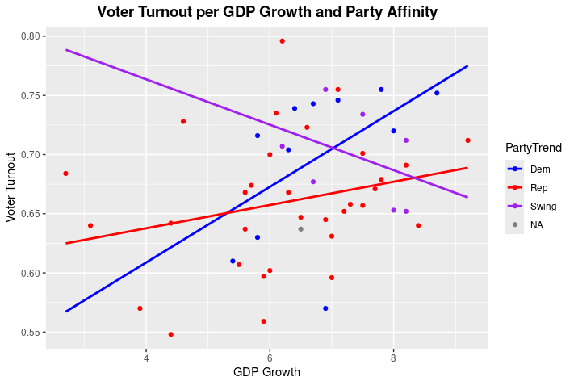

## Purpose
* I wanted to see whether or not the economy is a factor that influences turnout and increase my proficiency in R. 
## Conclusions
* While the hyper-partison states appears to have a loose correlation between Growth and Turnout, the swing states have a loose negative correlation.
* Only six states were considered "swing", so their may not have been enough data to show an accurate trend, considering how the correlation on the partison states was very loose
## Confounding Variables
* The election data was from 2020, so issues like Covid may have been more of driving factor compared to the economy.
* effects of issues may not be uniform across all states    
